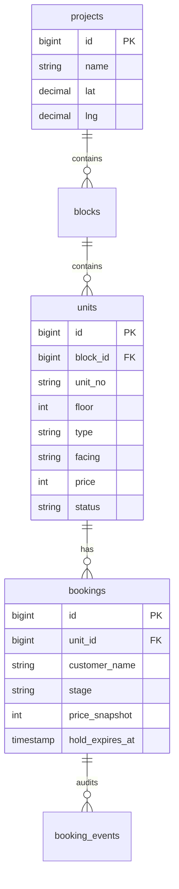

# PropDesk — Property Management System

> Real-estate inventory with a color-coded availability grid, a race-safe booking state machine, auto-expiring holds, and a Leaflet map — the domain I work in professionally, rebuilt as an open product.


## What's inside

- **Projects → Blocks → Units** hierarchy — 3 seeded Chennai projects, 328 units with type / floor / facing / area / price
- **Availability grid** — floor-wise, color-coded (available / held / booked / sold), filtered by type, facing, and budget; click an available unit to place a hold
- **Race-safe booking** — two concurrent holds on one unit: exactly one wins. The guard is a conditional `UPDATE … WHERE status = 'available'`; the loser gets a typed `409 UNIT_NOT_AVAILABLE`
- **Booking state machine** — hold → booked → sold (+ cancel), every transition written to `booking_events`; illegal jumps (hold → sold) rejected with `INVALID_TRANSITION`
- **Auto-expiring holds** — `holds:release` runs every minute from the scheduler, scans the `(stage, hold_expires_at)` index, cancels expired holds and frees units
- **Price snapshots** — the unit's price is copied *into* the booking at hold time; source prices change, contracts don't
- **Map view** — Leaflet + OpenStreetMap (no API key), project pins with availability popups
- **Dashboard** — inventory split per project, booking funnel
- **Auth** — JWT + rotating refresh tokens (from my [laravel-api-template](https://github.com/balajis-dev5/laravel-api-template))

## Stack

React 19 · TypeScript (strict) · Vite · Tailwind CSS v4 · React Leaflet — Laravel 12 · PHP 8.4 · SQLite/PostgreSQL · PHPUnit (27 tests)

## Quick start

```bash
# API
cd api && cp .env.example .env && composer install
php artisan key:generate
# set JWT_SECRET in .env (any long random string)
touch database/database.sqlite
php artisan migrate --seed && php artisan serve --port=8003

# Web (separate terminal)
cd web && npm install && npm run dev
```

Open http://localhost:5178 — sign in with `admin@example.com` / `password`
(seeder: 3 projects, 10 blocks, 328 units, 145 bookings with full audit trails).

## API

| Method | Endpoint | Notes |
|---|---|---|
| POST | `/api/v1/auth/login` `/refresh` `/logout` | JWT + rotating refresh |
| GET | `/api/v1/projects` | With per-status unit counts |
| GET | `/api/v1/projects/{id}/grid?type=2BHK&facing=east&max_price=…` | The availability grid, filterable |
| POST | `/api/v1/units/{id}/hold` | Atomic claim — 409 when the unit is taken |
| POST | `/api/v1/bookings/{id}/confirm` `/complete` `/cancel` | State machine, audited |
| GET | `/api/v1/bookings?stage=hold` | With unit → block → project chain |
| GET | `/api/v1/analytics/summary` | Inventory split + booking funnel |

## Schema (core)



## Design decisions worth asking me about

- **No double-booking without locks** — no `SELECT … FOR UPDATE`, no serializable isolation. A single conditional `UPDATE` claims the unit atomically; affected-rows tells you who won. Works identically on SQLite and Postgres.
- **Why snapshot the price into the booking?** Base price + floor rise are computed from source tables that keep changing. The contract price must be immutable — so it's copied at hold time.
- **Expiry without cron spam** — the scheduler scans one composite index every minute. At any realistic table size that's a sub-millisecond query; no queue infrastructure needed for v1.
- **Why Leaflet + OSM here (and Google Maps at work)?** The demo must run for anyone with zero setup — OSM tiles need no billing account. Swapping providers is one component's concern.

## Tests

```bash
cd api && php artisan test   # 27 tests, 109 assertions
```

Covers the double-hold race (second gets 409), price-snapshot immutability, the full hold → booked → sold lifecycle with audit trail, illegal-transition rejection, hold expiry (expired released, active kept), grid filters, and the auth flow.

## Roadmap

- v1.1 — floor-plan images with unit hotspots, payment schedules, marker clustering for city-scale project counts

MIT License
